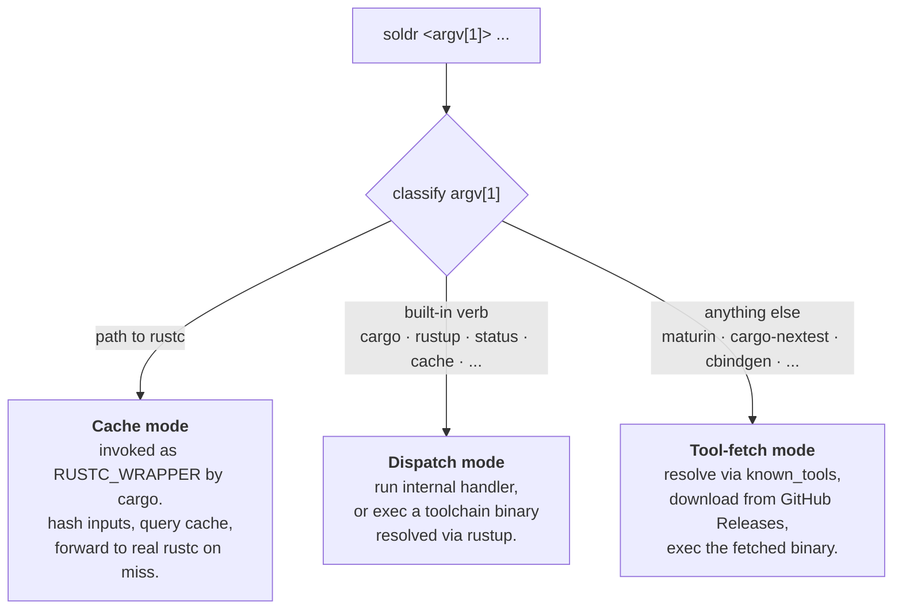
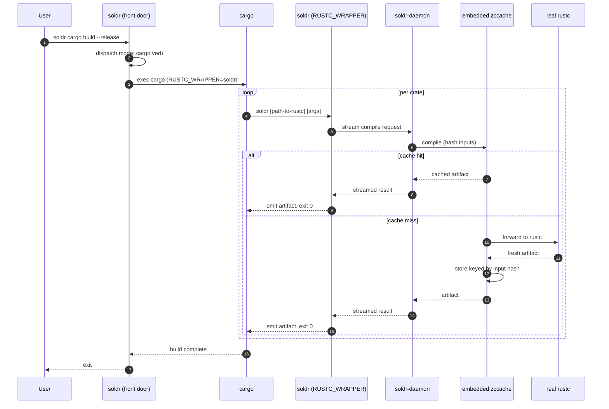

# Soldr / Rust


*Beta software, please pin*

*A tool to download rust tool sets and aggressive cache your build. **2× faster cross-PR builds** via content-addressed caching that swatinem's per-key cache cannot share. GH and local builds. Just add soldr before all your build commands.*


[](https://github.com/zackees/soldr/actions/workflows/ci.yml)
[](https://github.com/zackees/soldr/actions/workflows/release-auto.yml)

## Performance

[](https://zackees.github.io/soldr/)
[](https://zackees.github.io/soldr/)

*[performance details](https://zackees.github.io/soldr/)*

Cold builds are a wash; clean-target reconstruction from a warm compiler cache and cross-worktree sharing are where soldr's wrapper architecture pays off. The README chart's clean-target row intentionally deletes `target/`; it does not claim Cargo's intact-target freshness fast path. Full historical trend + interactive view: [zackees.github.io/soldr](https://zackees.github.io/soldr/). For the swatinem/rust-cache comparison (GHA target-dir caching, a different layer) see [PERF.md](PERF.md#readme-comparison-bars-issue-785).

**Instant tools. Instant builds. One command.**

soldr = [crgx](https://crgx.dev/) + [zccache](https://github.com/zackees/zccache) in a single tool.

**Where correct builds meet instant builds.**

The point of soldr is not to invent some brand-new primitive. The point is to combine the pieces that already work into one tool that people can actually rely on every day.

[zccache](https://github.com/zackees/zccache) is already excellent. [crgx](https://crgx.dev/) already proved the value of instant Rust tooling. soldr turns those into one front door:

- get the right Rust tool for the job
- get the right Windows ABI without thinking about it
- get transparent compilation caching without separate setup

That is the same reason [uv](https://github.com/astral-sh/uv) is compelling. uv did not win because it invented packaging, virtual environments, or Python installation. It won because it made the whole workflow feel like one tool instead of a pile of separate ones.

soldr aims for the same outcome in the Rust toolchain world.

Current release line:

- `0.5.x` is the secure front-door, tool-fetch, and built-in zccache-backed cache release line
- `1.0.0-rc` remains reserved for broader release hardening and bootstrap validation
- the supported external integration boundary remains the `soldr` executable, not the internal Rust crates; see [docs/API_BOUNDARY.md](./docs/API_BOUNDARY.md)
- practical integration examples for local builds and GitHub Actions live in [INTEGRATION.md](./INTEGRATION.md)

## Quick start

```bash
# 1. Install or upgrade (same command)
uv tool install --upgrade soldr

# 2. Put `soldr` in front of every Rust command
soldr cargo build --release
soldr cargo test
soldr cargo clippy --workspace

# 3. See what the cache is doing
soldr status
```

That is the whole integration. The first cacheable compile starts the
`soldr-daemon` sidecar, pins the toolchain from `rust-toolchain.toml`, and
every later build on any branch or worktree hits the shared cache.

<details>
<summary><b>Command reference</b></summary>

### Everyday

| Command | What it does |
|---|---|
| `soldr cargo <args>` | Run cargo through the cache with the pinned toolchain |
| `soldr build --target <triple\|alias>` | Blessed cross-compile with a managed SDK (`win-x64`, `mac-arm64`, `linux-x64-musl`, ...) |
| `soldr cc` / `soldr c++` | Compile C / C++ with a catalogue-backed toolchain |
| `soldr lint` | Unified Rust and dependency lint suites |
| `soldr ci-test` | **The supported way to test soldr-built projects.** The prescribed host-validation DAG used in CI — see [Testing strategy](#testing-strategy) |
| `soldr <tool>` | Fetch and run a pre-built ecosystem tool: `nextest`, `deny`, `audit`, `mdbook`, `just`, ... |

### Testing strategy

**Use `soldr ci-test`.** It is the supported long-term testing path and the
fastest one available: a frozen DAG that maximizes sharing by compile domain, so
stable host Clippy subsumes `cargo check`, nextest test-profile compilation
completes before execution overlaps the Dylint branch, and doctests join both.
Hand-rolled sequences of `cargo fmt` + `cargo clippy` + `cargo nextest` + doctests
recompile the same crates several times over and drift apart from what CI runs.

```bash
soldr ci-test                       # the whole host-validation DAG
soldr ci-test --explain-plan --format json   # inspect the plan, no compiler work
soldr ci-test --package soldr-core  # host-scope narrowing
```

**Know the one boundary.** `ci-test` validates on the *host* and deliberately
**rejects** `--target`, `--toolchain` and `--profile` rather than silently
creating a different compile domain. So it is not the tool for *executing*
binaries built for another platform. For that, build a nextest archive on the
cross-build lane and replay it on the target:

```bash
soldr cargo nextest archive --target <triple> --archive-file tests.tar.zst
# then, on (or emulating) the target:
cargo-nextest nextest run --archive-file tests.tar.zst --workspace-remap <checkout>
```

Two things bite consumers here, both observed in practice rather than
hypothesised:

* `cargo-nextest` is a **cargo subcommand shim**. Invoked as `cargo-nextest run`
  it proxies to cargo, which replies `unrecognized subcommand 'run'` — an error
  that reads like a broken archive. The `nextest` verb is required.
* A replay needs the **project source**, because the archive records its
  workspace root. Without it: `error: workspace root manifest at ... does not
  exist`. `--workspace-remap` must point at a real checkout.

And a caution soldr learned the hard way (soldr#2945): **a green CI lane only
proves the verb CI runs.** When a tool has more than one entry point, check that
they resolve their inputs through one implementation, or expect them to drift.

### Toolchain

| Command | What it does |
|---|---|
| `soldr rustc`, `rustfmt`, `clippy-driver`, `rustdoc` | Pinned-toolchain passthroughs |
| `soldr rustup <args>` | Passthrough to rustup, toolchain-aware |
| `soldr toolchain ensure` | Bootstrap rustup, install the pinned channel, components, and targets |
| `soldr toolchain link --shim-dir <dir>` | Write PATH shims that re-enter soldr |
| `soldr doctor` | Report drift between `rust-toolchain.toml` and rustup |
| `soldr rust-analyzer`, `rust-gdb`, `rust-lldb` | Language server and debuggers |

### Cache

| Command | What it does |
|---|---|
| `soldr status` | Cache status and active toolchain |
| `soldr cache` | Inspect compilation cache entries |
| `soldr cook` | Prebuild dependencies via bundled cargo-chef |
| `soldr save` / `soldr load` | Bundle a build cache to `.tar.zst` and restore it on a fresh checkout |
| `soldr gc` | Review reclaimable cargo `target/` directories |
| `soldr clean` / `soldr purge` | Clear the build cache / purge every soldr-managed artifact |
| `soldr config` | Show or set configuration in `~/.soldr/config.toml` |

### Ops

| Command | What it does |
|---|---|
| `soldr daemon start\|stop` | Manage the long-lived `soldr-daemon` process |
| `soldr optimize` | Platform-specific hot-cache tuning |
| `soldr defender-exclusions` | Manage Windows Defender exclusions for soldr caches |
| `soldr help <command>` | Full help for any command |

</details>

Also on npm as `@zackees/soldr`: a small launcher that downloads the matching
GitHub Release binary during install and verifies it against the published
`SHA256SUMS` file.

Published npm archives and PyPI wheels support both Intel (`x86_64`) and Apple
Silicon (`arm64`) macOS. Both are cross-built through soldr's blessed Apple
SDK path on Linux; Intel artifacts are then smoke-tested inside a
dockur/macos x86_64 guest hosted on an ordinary Linux runner before release
(no GitHub Actions job runs on a native macOS runner). Apple Silicon
artifacts are cross-built the same way but are not executed anywhere in CI
until a follow-up issue re-enables that before release.

## GitHub Actions setup

The current GitHub Actions entry point is the public `setup-soldr` action:

```yaml
- uses: zackees/setup-soldr@v0
  with:
    cache: true

- run: soldr cargo build --release
- run: soldr cargo test
```

That action:

> **Deprecated (soldr#2996).** soldr no longer implements a target cache, so the `target-cache` / `target-cache-mode` / `target-dir` inputs and the `target-cache-hit` / `target-cache-mode` outputs are inert: nothing on the soldr side reads the environment they export. They remain listed because the pinned action still declares them; retiring the inputs themselves is an upstream change. Use `soldr cook`, which is the only durable compiler cache.

- installs `soldr`
- bootstraps `rustup` into the cached runner-local root when the runner does not already have it
- preinstalls the exact Rust toolchain from `rust-toolchain.toml` by default via `rustup`
- restores a cacheable runner-local root for Soldr, Cargo, and rustup state
- restores and saves the Soldr-owned zccache compilation artifact cache under `SOLDR_CACHE_DIR` by default; set `build-cache: false` to disable it
- restores and saves a zccache-owned Rust artifact plan cache by default for no-op CI fast paths; set `target-cache: false` to disable it or `target-cache-mode: full` to opt into explicit whole-target caching
- puts `soldr` on `PATH` for later steps

For existing workflows where rewriting every `cargo ...` command is high-friction, opt into Cargo PATH shims:

```yaml
- uses: zackees/setup-soldr@v0
  with:
    tool-shims: cargo

- run: cargo build --release
- run: cargo test
```

The shim mode is off by default. When enabled, the action resolves the real Cargo binary before prepending its shim directory, then exports that real path for Soldr so `cargo ...` can safely trampoline into `soldr cargo ...` without recursive PATH lookup.

If your project pins Rust in `rust-toolchain.toml`, let the action read that file or pass the exact value with `toolchain:`. Do not preinstall a different generic toolchain such as `stable` and assume `soldr` will reconcile it later. The action exports `RUSTUP_TOOLCHAIN` after installation so later `cargo`, `rustc`, and `soldr cargo ...` steps stay on the toolchain it just installed instead of asking `rustup` to resolve a pinned file lazily.

On GitHub-hosted runners, this means you usually do not need a separate toolchain setup action for the normal path. The action still uses `rustup` under the hood today, but it bootstraps `rustup` itself when the runner does not already have it.
On runners without `rustup`, the action downloads and installs it into the cached runner-local root before provisioning the requested toolchain.

The public action lives in [`zackees/setup-soldr`](https://github.com/zackees/setup-soldr) and is generated from this repository's root action source. This repository dogfoods `zackees/setup-soldr@v0` in [setup-soldr-action.yml](./.github/workflows/setup-soldr-action.yml). For fuller examples and fallback patterns, see [INTEGRATION.md](./INTEGRATION.md).

### Native vs cross targets

`soldr cargo --target ...` runs the build through soldr/zccache, but it does not fetch a target's Rust standard library. If the active toolchain does not already have that target installed, the canonical failure is `error[E0463]: can't find crate for core/std` (or `compiler_builtins`) at the first compile step.

Native host targets work by default because `rustup` installs the host triple as part of the toolchain. Cross targets must be declared explicitly. Building `aarch64-pc-windows-msvc` from a Windows x86 runner, for example, requires provisioning `aarch64-pc-windows-msvc` before any `soldr cargo --target aarch64-pc-windows-msvc` invocation.

Two equivalent ways to declare a cross target: declaratively via `rust-toolchain.toml`'s `[toolchain].targets` (preferred — `setup-soldr` honors it during toolchain install), or imperatively via `soldr rustup target add` / `soldr toolchain prepare` (see [#331](https://github.com/zackees/soldr/issues/331) and [PR #333](https://github.com/zackees/soldr/pull/333)).

```toml
# rust-toolchain.toml — declarative (preferred)
[toolchain]
channel = "1.95.0"
targets = ["aarch64-pc-windows-msvc"]
```

```bash
# CLI — imperative
soldr rustup target add aarch64-pc-windows-msvc
soldr cargo build --target aarch64-pc-windows-msvc
```

```bash
# Orchestrated
soldr toolchain prepare
soldr cargo build --target aarch64-pc-windows-msvc
```

The canonical multi-platform GitHub Actions tutorial lives in [`zackees/setup-soldr#90`](https://github.com/zackees/setup-soldr/issues/90).

For Windows x64 → Windows GNU builds via managed MinGW-w64 GCC, and Linux →
Windows MSVC cross-compilation via the blessed `soldr build` surface (with
`soldr cargo xwin` retained as an explicit legacy fallback),
see [docs/CROSS_COMPILE.md](./docs/CROSS_COMPILE.md).

### CI cache lineage

GitHub Actions caches are not shared across arbitrary sibling feature branches. A workflow run can restore caches from its own branch, the default branch, and for pull requests the PR base branch. It cannot directly restore caches created on another feature branch.

That means Soldr treats `main` as the canonical warm-cache source:

- CI runs on pushes to `main` and feature branches.
- A feature-branch push can save a branch-local cache entry in its own branch scope.
- Later pushes and PRs for that same branch restore that branch-local cache first.
- If the feature branch has no exact cache yet, GitHub falls back to the `main` cache lineage through the same stable keys.
- The heavy cache-producing CI runs on branch pushes, not `pull_request`, so each feature branch gets one useful cache lineage instead of a duplicate PR merge-ref lineage.

In practice this gives the exact parent/child model we want: `main` acts as the shared parent cache, feature branches read from that parent on miss, and each feature branch may also save its own preferred child cache when the workflow runs on `push`. Pull requests then reflect the branch-push CI state instead of creating a second heavy cache path. This repository is the first reference implementation of that pattern. For the full wiring and rollout notes, see [docs/CI_CACHE.md](./docs/CI_CACHE.md).

## Why soldr exists

On Windows, the real problem is not "how do I cache builds?" or "how do I download a tool binary?" in isolation.

The real problem is that the execution path is messy:

- the wrong `cargo` can win on `PATH`
- the wrong Windows target can get selected
- GNU can leak in where MSVC should have been used
- users end up debugging their toolchain instead of shipping code

soldr exists to make that path boring.

When you run `soldr`, the tool should do the obvious thing:

- pick MSVC on Windows by default
- fetch the tool you asked for
- cache it locally
- host its embedded zccache service so Rust builds get transparent caching
  without manual wrapper or daemon setup

If soldr solves that one problem well, it becomes a super tool: the command you reach for first, because it makes the rest of the stack behave.

- **Tool acquisition** (the crgx half): Need `maturin`, `cargo-dylint`, or any crate binary? soldr fetches a pre-built binary from GitHub Releases in seconds. No `cargo install` from source. Cached locally for instant reuse. On `0.5.x`, this is still an upstream trust decision rather than a repo-side trust guarantee; see [docs/TRUST_BOUNDARIES.md](./docs/TRUST_BOUNDARIES.md).

- **Compilation caching** (the zccache half): `soldr cargo ...` routes rustc
  invocations through the zccache service embedded in `soldr-daemon`. zccache
  is compiled into the Soldr binaries; there is no separately downloaded or
  standalone zccache daemon. Soldr owns the build-session wiring and keeps its
  object store under the active Soldr root at
  `cache/zccache/daemon-state/embedded-v1/<zccache-version>/objects`.

```bash
# Build through soldr's front door:
soldr cargo build --release
soldr cargo test
soldr purge
SOLDR_RUSTC_WRAPPER=sccache soldr cargo build
SOLDR_RUSTC_WRAPPER=none soldr cargo build

# Shorthand: drop the `cargo` prefix for cargo's built-in verbs and for
# any cargo subcommand soldr already prebuilds. `soldr cargo <verb>` is
# preserved as the explicit escape hatch (always works), and the
# collision verbs `clean`, `config`, and `version` keep their
# soldr-native meaning. See docs/API.md "Cargo Verb Shorthand" for the
# full list.
soldr build --release          # == soldr cargo build --release
soldr test --workspace         # == soldr cargo test --workspace
soldr clippy -- -D warnings    # == soldr cargo clippy -- -D warnings
soldr nextest run              # == soldr cargo nextest run

# Fetch and run any Rust tool instantly:
soldr maturin build --release
soldr cargo-dylint check
soldr rustfmt src/main.rs
soldr dylint cook --workspace --all-targets  # exact-nightly dependency warmup
```

Rustfmt still runs through Soldr. Recursive invocations always execute the real
formatter because Cargo's explicit crate-root argv does not include child
modules that rustfmt discovers itself. A content-marker shortcut is used only
for invocations that explicitly set `skip_children=true`.

## Compile C and C++ directly

`soldr cc` and `soldr c++` expose the same catalogue-backed compilers and
sysroots used by blessed Rust cross-builds. GNU/Linux defaults to the pinned
glibc 2.17 toolchain:

```bash
soldr cc --target x86_64-linux-gnu.2.17 hello.c -o hello
./hello
```

CMake accepts the command plus its required target arguments through `CC` and
`CXX`:

```bash
CC="soldr cc --target x86_64-linux-gnu.2.17" \
CXX="soldr c++ --target x86_64-linux-gnu.2.17" \
  cmake -S . -B build
cmake --build build
```

Omit `--target` to select the host triple. The first standalone slice supports
the catalogue GNU/Linux and musl/Linux targets plus
`x86_64-pc-windows-gnu`. External build tooling can query the prepared tool
paths with `--print-cc`, `--print-cxx`, `--print-ar`, and `--print-linker`.

## Use soldr as your PEP 517 build backend (instead of maturin)

For Rust+Python packages, point `pyproject.toml` at soldr instead of
maturin and `pip install .` / `uv pip install .` route the whole build
through soldr:

```toml
[build-system]
requires = ["soldr"]
build-backend = "soldr"

# Your existing [tool.maturin] section stays exactly as it is —
# soldr drives a pinned maturin under the hood, so all maturin
# configuration keeps working unchanged.
[tool.maturin]
manifest-path = "crates/my-crate/Cargo.toml"
module-name = "my_pkg._native"
python-source = "src"
```

That is the entire change — no `maturin` entry in `requires`, no other
files touched. What you get over `build-backend = "maturin"`:

- **Pinned maturin, fetched on demand** — soldr downloads a pinned
  maturin binary (or provisions the PyPI wheel in an isolated
  uv-managed env if the binary fetch misses). Reproducible across
  machines; nothing to add to your dependencies.
- **Toolchain pinning** — the build uses the rustup toolchain your
  `rust-toolchain.toml` declares (MSVC on Windows), even when a stray
  GNU cargo or mingw shadows it on `PATH`.
- **Managed cmake + ninja** — cmake-based `*-sys` crates
  (`libz-ng-sys`, `zstd-sys`, ...) configure with pinned tools from the
  soldr toolchain archive instead of whatever `cmake`/`make` your
  `PATH` happens to serve.
- **Compilation caching** — rustc invocations run under soldr's
  `RUSTC_WRAPPER`, so repeat builds hit the cache.

Local PEP 517 builds use an explicit fast `dev` profile by default:
`opt-level = 0`, 256 codegen units, line-table debug information, no LTO, and
incremental compilation. Explicit Maturin/Cargo settings and
`SOLDR_PEP517_PROFILE` remain authoritative per setting; release pipelines
should select their release profile explicitly.

Successful wheel and editable builds print a one-line cache and timing summary
to stderr. Set `SOLDR_PEP517_STATS=off` to silence it; `SOLDR_PEP517_STATS=full`
(and detected verbose `pip`/`uv` frontends) also prints the complete session
statistics payload.

Soldr also caches the last successful wheel for each project/build mode under
`<effective-soldr-root>/pep517/wheels/`. The backend asks the selected soldr
binary for this root, so official (`.soldr`), development (`.soldr-dev`), and
custom roots remain separate even when `SOLDR_CACHE_DIR` was initially unset.
Before packaging it scans source and staged-artifact
metadata (relative path, size, and modification time); an unchanged tree
hardlinks the cached wheel into pip's requested output directory and skips
wheel rebuilding/compression. Set `SOLDR_PEP517_WHEEL_CACHE=off` to opt out.

Projects whose packaging backend is not maturin can use soldr as a managed
wrapper by selecting a delegate in `pyproject.toml`:

```toml
[build-system]
requires = ["soldr", "setuptools>=64"]
build-backend = "soldr"

[tool.soldr.pep517]
delegate-backend = "setuptools.build_meta"
```

The delegate receives the normal PEP 517/660 hooks and return values while
soldr supplies its target, profile, linker, and cache environment. This is
intended for projects with custom staging such as native CLI scripts plus a
PyO3 extension. Maturin remains the default when no delegate is configured.
The same explicit profile settings work for delegates as for maturin; for
example, `pip install . --config-settings profile=release` selects the
release profile, while an ordinary install uses the fast local `dev` profile.

The backend also asks soldr to try its fastest supported linker locally. If
that linker fails with a linker-availability error, soldr retries once with
the platform linker and remembers the successful fallback in its cache. An
equivalent later build uses the fallback immediately and prints a warning.
Set `SOLDR_PEP517_LINKER=none` to disable this policy. An explicit
`SOLDR_LINKER=fast` is treated as a deliberate choice: it reports the failure
without silently downgrading to the system linker.
Note: soldr's own wheel is built with plain `build-backend = "maturin"`,
not with itself — using soldr as its own build backend created a
bootstrap cycle where a broken installed soldr made the fix in this
repo uninstallable (`pip install .` pulled the *published* soldr wheel
and shelled out to the system `soldr` binary).

## How it works

soldr is a **chameleon binary**: one executable that picks its role from `argv[1]` on every invocation. Three roles:



When you run `soldr cargo build`, the two other modes both come into play.
soldr acts as the dispatch-mode front door, then cargo re-invokes soldr once
per crate as the `RUSTC_WRAPPER` — that second soldr is the cache-mode
instance that sends the compile to the zccache service embedded in
`soldr-daemon`:



The wrapper may run from a compiler-named multicall shim, but daemon recovery
always executes a canonical `soldr-daemon` alias. A daemon-lifetime singleton
lock, bind-before-publish startup, and PID/socket ownership checks prevent an
older or idle-timed-out process from deleting a newer daemon's endpoint.

Tool fetches are much simpler — no cargo, no rustc, no wrapper handshake:

```text
soldr maturin build --release
  +-- maturin cached?  --> run instantly
  +-- not cached?      --> download pre-built binary (2s) --> run
```

## Linker speed (the other half of fast CI)

soldr caches `rustc` invocations. It does **not** cache the linker step. If your build links many binaries (multiple `tests/*.rs` files, several `[[bin]]` targets, examples, benches), the dominant cost is often `ld`, and zccache will not help with that.

On Linux, switch to the `mold` linker for ~5-10x faster linking. Add to your repo's `.cargo/config.toml`:

```toml
[target.x86_64-unknown-linux-gnu]
linker = "clang"
rustflags = ["-C", "link-arg=-fuse-ld=mold"]

[target.x86_64-unknown-linux-musl]
linker = "clang"
rustflags = ["-C", "link-arg=-fuse-ld=mold"]
```

Then in CI, install mold before any cargo step:

```yaml
- name: Install mold linker
  run: |
    sudo apt-get update
    sudo apt-get install -y --no-install-recommends mold
```

macOS uses `ld64`, which is already fast and rarely worth swapping. Windows uses MSVC's linker, which `mold` does not target.

If you also have many separate test binaries, consider consolidating them under one `tests/<name>.rs` entry point with sub-modules. Fewer linker invocations is itself a multiplicative win on top of mold.

## Design goals

- **One obvious command**: Fetch tools, pick the right Windows target, and run through Soldr's embedded zccache service through the same entry point.
- **Front-door builds**: `soldr cargo ...` is the primary build UX.
- **Broker-owned caching**: `soldr cargo ...` uses the zccache service embedded in a broker-placed `soldr-daemon`; cacheable compiler work has one mandatory route.
- **Real cache controls**: `soldr status`, `soldr cache`, and `soldr clean` report and manage embedded-zccache state, while `soldr purge` removes all Soldr-managed cache artifacts for bug clearing and benchmarking.
- **One cache boundary**: official soldr keeps its tools and cache state under `~/.soldr/`; development builds use `~/.soldr-dev/`. Use `SOLDR_CACHE_DIR` to select an explicit root.
- **Bounded while idle**: the long-lived daemon owns only its selected root,
  checks pressure every five minutes, expires old state daily, and installs no
  OS scheduler. Embedded zccache defaults to 5% of the filesystem clamped to
  40–200 GiB, becomes aggressive for entries older than four days near full,
  and expires artifacts after 30 days. Production, development (`.soldr-dev`),
  custom, and standalone `.zccache` roots never sweep one another.
- **Disposable-worktree friendly on Windows**: for build orchestration, soldr can relocate itself under `~/.soldr/runtime/soldr-self/` so `RUSTC_WRAPPER` does not keep using a worktree-local `soldr.exe`; stale runtime copies are cleaned up periodically.
- **Pre-built first**: Download a pre-built binary before compiling from source. Fall back gracefully.
- **Cargo-compatible**: soldr preserves normal cargo arguments instead of forcing a separate workflow.
- **Cross-platform**: Linux, macOS, Windows (x86_64 + aarch64).
- **MSVC by default on Windows**: Always targets `x86_64-pc-windows-msvc` (or `aarch64-pc-windows-msvc`) unless the active project explicitly selects another target in `.cargo/config.toml`, `.cargo/config`, or `rust-toolchain.toml`. MSVC links against `vcruntime140.dll` which ships with every modern Windows install. The GNU target requires shipping `libgcc_s_seh-1.dll` and `libwinpthread-1.dll` with every binary, which is extra baggage for most projects; when a project explicitly needs `x86_64-pc-windows-gnu`, `soldr prepare --target x86_64-pc-windows-gnu` provisions managed MinGW-w64 GCC on Windows x64. This matches the Rust ecosystem default: rustup, cargo-binstall, and nearly all published release binaries target MSVC. crgx gets this wrong by baking the target at compile time, causing it to look for GNU binaries when compiled under MSYS2.

## Architecture

**Internal workspace crates.** Five `publish = false` crates under `crates/`. The 2026-05 monocrate collapse was reversed by the #1490 split; soldr publishes no crates, so workspace membership has no external surface, and `soldr-cli` re-exports the others at their historical paths (`soldr_cli::core`, `soldr_cli::fetch`, …) so existing imports are unchanged.

```
soldr/
|-- crates/
|   |-- soldr-core/               # Shared types, config, target resolution, wire schema
|   |-- soldr-fetch/              # Binary resolution + download
|   |-- soldr-cache/              # RUSTC_WRAPPER + daemon IPC + archive transport
|   |-- soldr-daemon/             # Daemon runtime + embedded zccache service
|   `-- soldr-cli/                # Facade + the `soldr` binary
|-- src/soldr/                    # Python package (maturin bin bindings)
`-- tests/
```

| Crate | Role |
|---|---|
| `soldr-core` | Shared types, config (`~/.soldr/config.toml`), target-triple resolution (MSVC default on Windows), the daemon wire schema, error types. No I/O beyond config files. |
| `soldr-fetch` | Binary resolution. `known_tools` registry, `trust` (SHA-256 pins + `SOLDR_TRUST_MODE` enforcement), rustup auto-bootstrap, resolution chain (local cache → repo lookup → GitHub Releases → extract). |
| `soldr-cache` | `RUSTC_WRAPPER` mode: hash inputs (blake3), check `~/.soldr/cache/`, daemon IPC (Unix socket / Windows named pipe), LRU eviction, `soldr save` / `soldr hydrate` (`load` alias) archive transport, auto-GC. |
| `soldr-daemon` | Daemon lifecycle (spawn/displacement/relocation), IPC server, wire codec, and the embedded zccache service. Depends on `soldr-core` + `soldr-cache`. |
| `soldr-cli` | Mode detection (chameleon dispatch), clap for built-ins, exec for tool fetch, cargo front door (`soldr cargo ...`), and the `[[bin]]` entry point. |

Dependency flow: every crate reaches into `core` for shared types; `fetch` and `cache` each consume `core`; `daemon` consumes `core` + `cache`; `cli` consumes all four. The re-exports are for internal consumers and tests — this is not a supported public Rust library API.

## Prior art

Built on lessons from:
- [zccache](https://github.com/zackees/zccache) - 2.4x faster warm builds than sccache ([benchmark](https://github.com/zackees/zccache/issues/20))
- [crgx](https://crgx.dev/) - the npx of Rust, instant tool execution
- [cargo-binstall](https://github.com/cargo-bins/cargo-binstall) - pre-built binary resolution
- [sccache](https://github.com/mozilla/sccache) - the original Rust compilation cache

## Security And Verification

- [SECURITY.md](./SECURITY.md) describes the current hardening posture and release policy.
- [docs/API_BOUNDARY.md](./docs/API_BOUNDARY.md) defines the supported machine-facing integration boundary.
- [docs/PYPI_TRUSTED_PUBLISHING.md](./docs/PYPI_TRUSTED_PUBLISHING.md) describes the optional Trusted Publishing path for hardened PyPI wheels.
- [`.github/workflows/release-auto.yml`](./.github/workflows/release-auto.yml) is the only release workflow: when a reviewed version bump lands on `main`, it derives the version from `Cargo.toml`, reruns the release gate, and performs final publication through the `release` environment where the release credentials live.
- [RELEASE.md](./RELEASE.md) documents the intended maximum-security release setup and owner workflow.
- [docs/RELEASE_VERIFICATION.md](./docs/RELEASE_VERIFICATION.md) explains how to verify published release artifacts.
- [docs/TRUST_BOUNDARIES.md](./docs/TRUST_BOUNDARIES.md) inventories the external systems and artifacts `soldr` currently trusts, including the current `0.5.x` limits of runtime fetched-binary trust.

## License

GNU Affero General Public License v3.0 only (AGPL-3.0-only). See [LICENSE](LICENSE).

Historical BSD-3-Clause notices are retained in [LICENSE-BSD-3-Clause](LICENSE-BSD-3-Clause).
