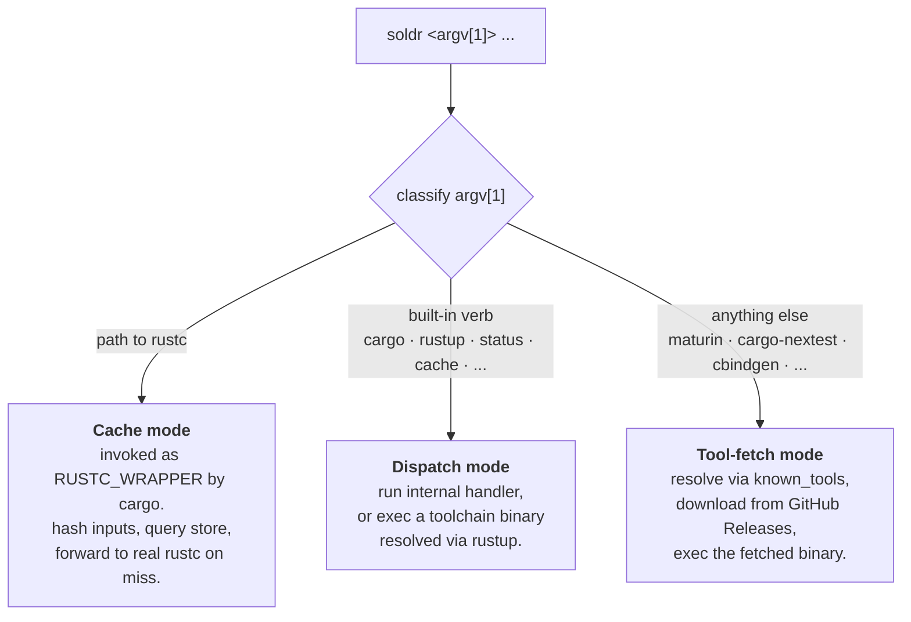
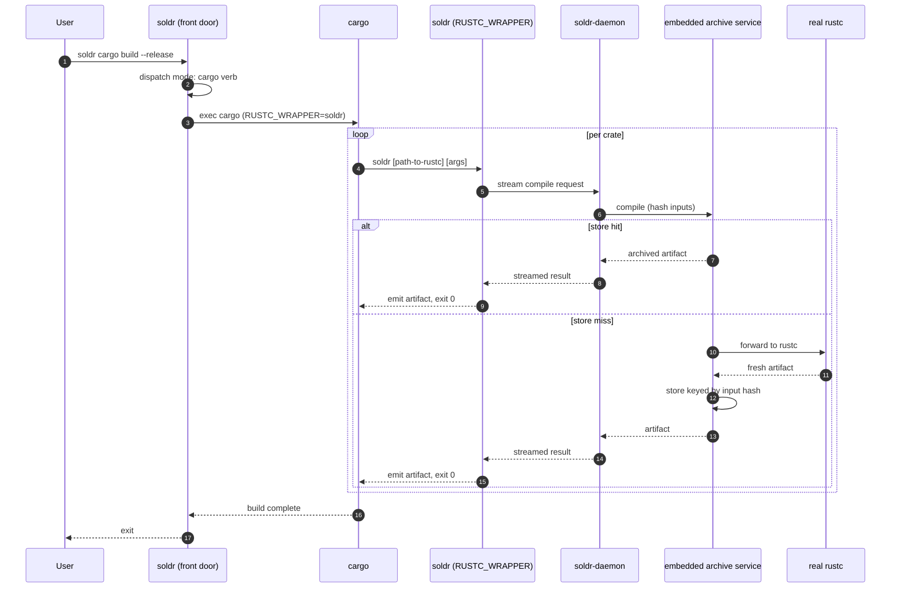

# Soldr

> ## Archive your Rust build state once. Rehydrate it anywhere, in seconds, locally and in GitHub Actions.

> **The one Rust build tool that treats build state as a portable, content-addressed artifact instead of a per-key cache.** Every compiled unit is stored by the hash of its inputs, so a build done on `main`, in another worktree, or in a previous CI run rehydrates into your current checkout as a hit. Per-key caches such as `swatinem/rust-cache` cannot share across those boundaries; soldr's archives are **2× faster on cross-PR builds** because they can.

soldr is a single binary you put in front of every Rust command. It saves the
state a build produces, brings that state back on the next machine or the next
job, and fetches pre-built Rust tools so nothing waits on `cargo install`.
It is accelerated for the two places builds actually happen: a developer's
worktree and a GitHub Actions runner.


```
                   soldr cargo build
                          |
                          v
         +--------------------------------+
         |     per-unit compile results   |
         |  keyed by BLAKE3(inputs)       |
         |  path-independent, hardlinked  |
         +---------------+----------------+
                         |
              ARCHIVE    |    (soldr save / soldr cook / setup-soldr cache)
                         v
         +--------------------------------+
         |      build-state archive       |
         |   .tar.zst, content-addressed  |
         +-------+----------------+-------+
                 |                |
     REHYDRATE   |                |   REHYDRATE
                 v                v
   +---------------------+  +---------------------+
   |   local worktree    |  |  GitHub Actions job |
   |  soldr hydrate      |  |  setup-soldr        |
   |  -> cargo sees hits |  |  -> cargo sees hits |
   +---------------------+  +---------------------+
```

Rehydration restores the compiler store and replays source mtimes, so cargo
rebuilds a fresh checkout and every unit that has not changed comes back as a
hit instead of a compile. It does not fake cargo's freshness check: the mtime
replay is guarded by size and BLAKE3 hash, so a real source change always
rebuilds.

*Beta software, please pin.*

[](https://github.com/zackees/soldr/actions/workflows/ci.yml)
[](https://github.com/zackees/soldr/actions/workflows/release-auto.yml)

**Contents**

- [Quick start](#quick-start): install, build, save, rehydrate, run tools, cross-compile
- [Performance](#performance): continuous benchmarks vs. sccache and bare cargo
- [Why use soldr](#why-use-soldr): build state as an artifact, one path locally and in CI, correct by default
- [Build state lifecycle](#build-state-lifecycle): what is archived, how it is addressed, when it is invalid
- [GitHub Actions](#github-actions): the `setup-soldr` action, cross targets, cache lineage
- [More surfaces](#more-surfaces): C and C++ compilers, PEP 517 backend, linker speed
- [How it works](#how-it-works): the chameleon binary, the wrapper, the daemon
- [Documentation](#documentation): the full docs index
- [Prior art](#prior-art)
- [Security and verification](#security-and-verification)
- [License](#license)

---

## Quick start

### Install

```bash
# npm
npm install -g @zackees/soldr
soldr --version

# PyPI (pin in CI)
uv pip install soldr
pip install soldr==X.Y.Z
```

The npm package is a small launcher that downloads the matching `soldr` GitHub
Release binary for your OS and architecture during install, verifies it against
the published `SHA256SUMS` file, and exposes the `soldr` command.

Published npm archives and PyPI wheels support both Intel (`x86_64`) and Apple
Silicon (`arm64`) macOS. Intel artifacts are cross-built through soldr's
blessed Apple SDK path and smoke-tested on an Intel macOS runner before release.

### Build, and it archives itself

Put `soldr` in front of the cargo command you already run. Every rustc
invocation is routed through soldr, hashed, and stored under `~/.soldr/`.

```bash
soldr cargo build --release
soldr cargo test

# Shorthand: drop the `cargo` prefix for cargo's built-in verbs and for
# any cargo subcommand soldr already prebuilds. `soldr cargo <verb>` is
# preserved as the explicit escape hatch (always works), and the
# collision verbs `clean`, `config`, and `version` keep their
# soldr-native meaning. See docs/API.md "Cargo Verb Shorthand" for the
# full list.
soldr build --release          # == soldr cargo build --release
soldr test --workspace         # == soldr cargo test --workspace
soldr clippy -- -D warnings    # == soldr cargo clippy -- -D warnings
soldr nextest run              # == soldr cargo nextest run

# Escape hatches and cleanup
SOLDR_RUSTC_WRAPPER=sccache soldr cargo build   # use another wrapper
SOLDR_RUSTC_WRAPPER=none soldr cargo build      # no caching at all
soldr purge                                     # drop every soldr-managed artifact
```

A second `git worktree` of the same repository hits the first one's results
immediately. Artifacts are stored path-independent, so nothing has to be
rebuilt because the checkout moved.

### Save and rehydrate

`soldr save` bundles the compiler store plus a content-verified snapshot of
source-file mtimes into one `.tar.zst`. `soldr hydrate` (alias `soldr load`)
restores both on a fresh checkout.

```bash
# On the machine that already has a warm build
soldr save --cache-dir ~/.soldr/cache --workspace . --out build-state.tar.zst

# On a fresh checkout, anywhere
soldr hydrate --archive build-state.tar.zst --cache-dir ~/.soldr/cache --workspace .
soldr cargo build --release     # every unchanged unit is a hit
```

Mtimes are replayed only where the current file's size and BLAKE3 hash still
match the snapshot, so a rehydrated tree can never underbuild after a real
source change. Add `--ci` (alias `--minimal`) to `soldr save` to exclude logs,
sockets, and managed toolchain trees from the archive.

For the dependency layer specifically, `soldr cook` prebuilds the dep set as a
content-addressable layer that survives source commits and works as a Docker
layer, a CI tarball, or a warm local `target/`:

```bash
soldr cook --workspace --release
```

### Rehydrate in GitHub Actions

The public `setup-soldr` action installs soldr, provisions the pinned
toolchain, and restores and saves the build-state archive across runs.

```yaml
- uses: zackees/setup-soldr@v0
  with:
    cache: true

- run: soldr cargo build --release
- run: soldr cargo test
```

`main` acts as the parent archive; feature branches rehydrate from it on a miss
and save their own child. Details in [GitHub Actions](#github-actions).

### Run any Rust tool instantly

Need `maturin`, `cargo-nextest`, `cargo-dylint`, or any crate binary? soldr
fetches a pre-built binary from GitHub Releases in seconds, verifies its
sha256, and caches it locally. No `cargo install` from source.

```bash
soldr maturin build --release
soldr cargo-dylint check
soldr rustfmt src/main.rs
soldr dylint cook --workspace --all-targets  # exact-nightly dependency warmup
```

Rustfmt still runs through soldr. Recursive invocations always execute the real
formatter because Cargo's explicit crate-root argv does not include child
modules that rustfmt discovers itself. A content-marker shortcut is used only
for invocations that explicitly set `skip_children=true`.

### Cross-compile

`soldr build --target <triple>` prepares a pinned, sha256-verified SDK and the
compiler and linker shims for it, then builds through cargo. Friendly aliases
such as `win-x64` and `mac-arm64` are accepted.

```bash
soldr build --target x86_64-pc-windows-msvc
soldr build --target aarch64-apple-darwin
```

On Windows, soldr picks MSVC by default, so the GNU toolchain never leaks in
where MSVC was wanted. Recipes for every supported pair, including the legacy
`soldr cargo xwin` and `soldr cargo zigbuild` passthroughs, are in
[docs/CROSS_COMPILE.md](./docs/CROSS_COMPILE.md).

### Going deeper

Everything past this point is detail. The full CLI and environment-variable
reference is [docs/API.md](./docs/API.md); worked local and CI examples are
in [INTEGRATION.md](./INTEGRATION.md); the CI archive wiring is in
[docs/CI_CACHE.md](./docs/CI_CACHE.md).

---

## Performance

[](https://zackees.github.io/soldr/)
[](https://zackees.github.io/soldr/)

*[performance details](https://zackees.github.io/soldr/)*

Cold builds are a wash. Clean-target rehydration from a warm store and
cross-worktree sharing are where soldr's architecture pays off. The chart's
clean-target row intentionally deletes `target/` and rebuilds from the archive;
it does not claim Cargo's intact-target freshness fast path. Full historical
trend and interactive view: [zackees.github.io/soldr](https://zackees.github.io/soldr/).
For the `swatinem/rust-cache` comparison (GHA target-dir caching, a different
layer) see [PERF.md](PERF.md#readme-comparison-bars-issue-785).

---

## Why use soldr

**Build state is an artifact, not a cache key.** A per-key cache asks "did this
exact lockfile on this exact branch build before?" soldr asks "has this exact
compilation unit, with these exact inputs, been compiled by anyone?" The second
question has far more yes answers. Any PR, worktree, or branch that shares a
dependency graph shares hits.

**Rehydration is accelerated, not replayed.** Restoring an archive lays the
store back down on disk and hardlinks artifacts into place; cargo then sees a
tree where every unchanged unit is already done. Nothing is recompiled to
"warm up" a cache.

**Same archive locally and in GitHub Actions.** One mechanism, one store
layout, one set of commands. The `setup-soldr` action does what `soldr save`
and `soldr hydrate` do, with GitHub's cache as the transport, so there is no
second cache system to tune per platform.

**Tools rehydrate the same way.** Pre-built tool binaries are fetched once,
sha256-verified, and cached beside the build state. `soldr maturin`,
`soldr nextest`, and `soldr cbindgen` start in seconds on a fresh machine.

**Correct by default.** On Windows the real problem is not caching or
downloading in isolation. It is that the wrong `cargo` can win on `PATH`, the
wrong target can get selected, GNU can leak in where MSVC should have been
used, and people end up debugging their toolchain instead of shipping code.
soldr makes that path boring: MSVC by default, one cargo, the toolchain
`rust-toolchain.toml` declares, and the same answer on every machine.

**Verified.** Every fetch records a sha256. Pins are opt-in via
`SOLDR_CHECKSUMS_FILE`; `SOLDR_TRUST_MODE=strict` refuses unpinned fetches.
Rehydration checks source hashes before it trusts a snapshot. On `0.5.x`,
runtime fetched-binary trust is still an upstream decision rather than a
repo-side guarantee; see [docs/TRUST_BOUNDARIES.md](./docs/TRUST_BOUNDARIES.md).

The point of soldr is not to invent a brand-new primitive. It combines pieces
that already work into one tool people can rely on every day, the same reason
[uv](https://github.com/astral-sh/uv) is compelling. uv did not win because it
invented packaging or virtual environments. It won because it made the whole
workflow feel like one tool instead of a pile of separate ones. soldr aims for
the same outcome in the Rust toolchain world.

Current release line:

- `0.5.x` is the secure front-door, tool-fetch, and built-in build-state archive release line
- `1.0.0-rc` remains reserved for broader release hardening and bootstrap validation
- the supported external integration boundary remains the `soldr` executable, not the internal Rust crates; see [docs/API_BOUNDARY.md](./docs/API_BOUNDARY.md)
- practical integration examples for local builds and GitHub Actions live in [INTEGRATION.md](./INTEGRATION.md)

---

## Build state lifecycle

### What is archived

| Layer | Produced by | Contents |
|---|---|---|
| Per-unit compile results | every `soldr cargo ...` build | one entry per rustc invocation, keyed by input hash |
| Dependency layer | `soldr cook` | the prebuilt dep set as a content-addressable layer |
| Save archive | `soldr save` | the compiler store plus a hash-verified source mtime snapshot |
| Tools | first `soldr <tool>` run | pre-built binaries with recorded sha256 |

Linked test binaries, benches, examples, and incremental state are never
archived. They invalidate on every source edit and would only bloat the
archive (soldr#2931).

### How it is addressed

Each unit's key is a BLAKE3 hash over the compiler, its arguments, its
environment, and every input file. Absolute source paths are remapped before
hashing, so two checkouts of the same repository in different directories, or
a tarball with no `.git` at all, produce identical keys and share artifacts.

### Where it lives

Official builds keep everything under `~/.soldr/`; development builds use
`~/.soldr-dev/`; `SOLDR_CACHE_DIR` selects an explicit root. The store is
bounded while idle: the daemon checks pressure every five minutes, expires old
state daily, defaults to 5% of the filesystem clamped to 40–200 GiB, becomes
aggressive for entries older than four days near full, and expires artifacts
after 30 days. Separate roots never sweep one another. The daemon itself
exits after 30 minutes idle; maintenance markers persist under the root, so a
restarted daemon runs any overdue pass immediately and none of these schedules
depend on a daemon staying resident.

`soldr status`, `soldr cache`, and `soldr clean` report and manage the store.
`soldr purge` removes every soldr-managed artifact for bug clearing and
benchmarking.

### Rehydrate vs. materialize

*Rehydrate* restores the store and the mtime snapshot from an archive.
*Materialize* is what happens on the next `soldr cargo build`: cargo walks the
graph, each unit's key is looked up, and hits are hardlinked into `target/`
instead of compiled. soldr does not restore `target/` itself and does not
bypass cargo's own freshness logic.

### Invalidation

A unit's key changes when any input changes: source, compiler version, flags,
features, or environment cargo passes through. Nothing else invalidates it.
Moving the checkout, switching branches, or opening a new worktree does not.

---

## GitHub Actions

The current GitHub Actions entry point is the public `setup-soldr` action:

```yaml
- uses: zackees/setup-soldr@v0
  with:
    cache: true

- run: soldr cargo build --release
- run: soldr cargo test
```

That action:

- installs `soldr`
- bootstraps `rustup` into the cached runner-local root when the runner does not already have it
- preinstalls the exact Rust toolchain from `rust-toolchain.toml` by default via `rustup`
- restores a cacheable runner-local root for Soldr, Cargo, and rustup state
- restores and saves the soldr-owned build-state archive under `SOLDR_CACHE_DIR` by default; set `build-cache: false` to disable it
- still declares `target-cache` / `target-cache-mode` / `target-dir` inputs, but they are inert (see below)
- puts `soldr` on `PATH` for later steps

> **Deprecated (soldr#2996).** soldr no longer implements a target cache, so the `target-cache` / `target-cache-mode` / `target-dir` inputs and the `target-cache-hit` / `target-cache-mode` outputs are inert: nothing on the soldr side reads the environment they export. They remain listed because the pinned action still declares them; retiring the inputs themselves is an upstream change. Use `soldr cook`, which is the only durable compiler cache.

For existing workflows where rewriting every `cargo ...` command is high-friction, opt into Cargo PATH shims:

```yaml
- uses: zackees/setup-soldr@v0
  with:
    tool-shims: cargo

- run: cargo build --release
- run: cargo test
```

The shim mode is off by default. When enabled, the action resolves the real Cargo binary before prepending its shim directory, then exports that real path for Soldr so `cargo ...` can safely trampoline into `soldr cargo ...` without recursive PATH lookup.

If your project pins Rust in `rust-toolchain.toml`, let the action read that file or pass the exact value with `toolchain:`. Do not preinstall a different generic toolchain such as `stable` and assume `soldr` will reconcile it later. The action exports `RUSTUP_TOOLCHAIN` after installation so later `cargo`, `rustc`, and `soldr cargo ...` steps stay on the toolchain it just installed instead of asking `rustup` to resolve a pinned file lazily.

On GitHub-hosted runners, this means you usually do not need a separate toolchain setup action for the normal path. The action still uses `rustup` under the hood today, but it bootstraps `rustup` itself when the runner does not already have it.
On runners without `rustup`, the action downloads and installs it into the cached runner-local root before provisioning the requested toolchain.

The public action lives in [`zackees/setup-soldr`](https://github.com/zackees/setup-soldr) and is generated from this repository's root action source. This repository dogfoods `zackees/setup-soldr@v0` in [setup-soldr-action.yml](./.github/workflows/setup-soldr-action.yml). For fuller examples and fallback patterns, see [INTEGRATION.md](./INTEGRATION.md).

### Native vs cross targets

`soldr cargo --target ...` runs the build through soldr, but it does not fetch a target's Rust standard library. If the active toolchain does not already have that target installed, the canonical failure is `error[E0463]: can't find crate for core/std` (or `compiler_builtins`) at the first compile step.

Native host targets work by default because `rustup` installs the host triple as part of the toolchain. Cross targets must be declared explicitly. Building `aarch64-pc-windows-msvc` from a Windows x86 runner, for example, requires provisioning `aarch64-pc-windows-msvc` before any `soldr cargo --target aarch64-pc-windows-msvc` invocation.

Two equivalent ways to declare a cross target: declaratively via `rust-toolchain.toml`'s `[toolchain].targets` (preferred; `setup-soldr` honors it during toolchain install), or imperatively via `soldr rustup target add` / `soldr toolchain prepare` (see [#331](https://github.com/zackees/soldr/issues/331) and [PR #333](https://github.com/zackees/soldr/pull/333)).

```toml
# rust-toolchain.toml — declarative (preferred)
[toolchain]
channel = "1.95.0"
targets = ["aarch64-pc-windows-msvc"]
```

```bash
# CLI — imperative
soldr rustup target add aarch64-pc-windows-msvc
soldr cargo build --target aarch64-pc-windows-msvc
```

```bash
# Orchestrated
soldr toolchain prepare
soldr cargo build --target aarch64-pc-windows-msvc
```

The canonical multi-platform GitHub Actions tutorial lives in [`zackees/setup-soldr#90`](https://github.com/zackees/setup-soldr/issues/90).

For Windows x64 → Windows GNU builds via managed MinGW-w64 GCC, and Linux →
Windows MSVC cross-compilation via the blessed `soldr build` surface (with
`soldr cargo xwin` retained as an explicit legacy fallback),
see [docs/CROSS_COMPILE.md](./docs/CROSS_COMPILE.md).

### CI cache lineage

GitHub Actions caches are not shared across arbitrary sibling feature branches. A workflow run can restore caches from its own branch, the default branch, and for pull requests the PR base branch. It cannot directly restore caches created on another feature branch.

That means soldr treats `main` as the canonical parent archive:

- CI runs on pushes to `main` and feature branches.
- A feature-branch push can save a branch-local archive in its own branch scope.
- Later pushes and PRs for that same branch rehydrate that branch-local archive first.
- If the feature branch has no exact archive yet, GitHub falls back to the `main` lineage through the same stable keys.
- The heavy archive-producing CI runs on branch pushes, not `pull_request`, so each feature branch gets one useful lineage instead of a duplicate PR merge-ref lineage.

In practice this gives the parent/child model we want: `main` acts as the shared parent, feature branches read from that parent on miss, and each feature branch may also save its own child when the workflow runs on `push`. Pull requests then reflect the branch-push CI state instead of creating a second heavy path. This repository is the first reference implementation of that pattern. For the full wiring and rollout notes, see [docs/CI_CACHE.md](./docs/CI_CACHE.md).

### Compared to per-key caches

`swatinem/rust-cache` and similar actions save and restore `target/` under a
key derived from the lockfile and branch. A miss on the key is a miss on
everything, and sibling branches cannot see each other's work. soldr's archive
is content-addressed per unit, so a partial match is a partial hit and the
`main` lineage serves every branch. `sccache` shares the per-unit idea but is a
separate daemon, a separate setup, and a separate cache to wire into CI. soldr
folds that into the same command you already run. Benchmarks against both are
in [Performance](#performance).

---

## More surfaces

### Compile C and C++ directly

`soldr cc` and `soldr c++` expose the same catalogue-backed compilers and
sysroots used by blessed Rust cross-builds. GNU/Linux defaults to the pinned
glibc 2.17 toolchain:

```bash
soldr cc --target x86_64-linux-gnu.2.17 hello.c -o hello
./hello
```

CMake accepts the command plus its required target arguments through `CC` and
`CXX`:

```bash
CC="soldr cc --target x86_64-linux-gnu.2.17" \
CXX="soldr c++ --target x86_64-linux-gnu.2.17" \
  cmake -S . -B build
cmake --build build
```

Omit `--target` to select the host triple. The first standalone slice supports
the catalogue GNU/Linux and musl/Linux targets plus
`x86_64-pc-windows-gnu`. External build tooling can query the prepared tool
paths with `--print-cc`, `--print-cxx`, `--print-ar`, and `--print-linker`.

### Use soldr as your PEP 517 build backend (instead of maturin)

For Rust+Python packages, point `pyproject.toml` at soldr instead of
maturin and `pip install .` / `uv pip install .` route the whole build
through soldr:

```toml
[build-system]
requires = ["soldr"]
build-backend = "soldr"

# Your existing [tool.maturin] section stays exactly as it is —
# soldr drives a pinned maturin under the hood, so all maturin
# configuration keeps working unchanged.
[tool.maturin]
manifest-path = "crates/my-crate/Cargo.toml"
module-name = "my_pkg._native"
python-source = "src"
```

That is the entire change: no `maturin` entry in `requires`, no other
files touched. What you get over `build-backend = "maturin"`:

- **Pinned maturin, fetched on demand.** soldr downloads a pinned
  maturin binary (or provisions the PyPI wheel in an isolated
  uv-managed env if the binary fetch misses). Reproducible across
  machines; nothing to add to your dependencies.
- **Toolchain pinning.** The build uses the rustup toolchain your
  `rust-toolchain.toml` declares (MSVC on Windows), even when a stray
  GNU cargo or mingw shadows it on `PATH`.
- **Managed cmake + ninja.** cmake-based `*-sys` crates
  (`libz-ng-sys`, `zstd-sys`, ...) configure with pinned tools from the
  soldr toolchain archive instead of whatever `cmake`/`make` your
  `PATH` happens to serve.
- **Build-state archiving.** rustc invocations run under soldr's
  `RUSTC_WRAPPER`, so repeat builds hit the store.

Local PEP 517 builds use an explicit fast `dev` profile by default:
`opt-level = 0`, 256 codegen units, line-table debug information, no LTO, and
incremental compilation. Explicit Maturin/Cargo settings and
`SOLDR_PEP517_PROFILE` remain authoritative per setting; release pipelines
should select their release profile explicitly.

Successful wheel and editable builds print a one-line cache and timing summary
to stderr. Set `SOLDR_PEP517_STATS=off` to silence it; `SOLDR_PEP517_STATS=full`
(and detected verbose `pip`/`uv` frontends) also prints the complete session
statistics payload.

Soldr also caches the last successful wheel for each project/build mode under
`<effective-soldr-root>/pep517/wheels/`. The backend asks the selected soldr
binary for this root, so official (`.soldr`), development (`.soldr-dev`), and
custom roots remain separate even when `SOLDR_CACHE_DIR` was initially unset.
Before packaging it scans source and staged-artifact
metadata (relative path, size, and modification time); an unchanged tree
hardlinks the cached wheel into pip's requested output directory and skips
wheel rebuilding/compression. Set `SOLDR_PEP517_WHEEL_CACHE=off` to opt out.

Projects whose packaging backend is not maturin can use soldr as a managed
wrapper by selecting a delegate in `pyproject.toml`:

```toml
[build-system]
requires = ["soldr", "setuptools>=64"]
build-backend = "soldr"

[tool.soldr.pep517]
delegate-backend = "setuptools.build_meta"
```

The delegate receives the normal PEP 517/660 hooks and return values while
soldr supplies its target, profile, linker, and cache environment. This is
intended for projects with custom staging such as native CLI scripts plus a
PyO3 extension. Maturin remains the default when no delegate is configured.
The same explicit profile settings work for delegates as for maturin; for
example, `pip install . --config-settings profile=release` selects the
release profile, while an ordinary install uses the fast local `dev` profile.

The backend also asks soldr to try its fastest supported linker locally. If
that linker fails with a linker-availability error, soldr retries once with
the platform linker and remembers the successful fallback in its cache. An
equivalent later build uses the fallback immediately and prints a warning.
Set `SOLDR_PEP517_LINKER=none` to disable this policy. An explicit
`SOLDR_LINKER=fast` is treated as a deliberate choice: it reports the failure
without silently downgrading to the system linker.
Note: soldr's own wheel is built with plain `build-backend = "maturin"`,
not with itself. Using soldr as its own build backend created a
bootstrap cycle where a broken installed soldr made the fix in this
repo uninstallable (`pip install .` pulled the *published* soldr wheel
and shelled out to the system `soldr` binary).

### Linker speed (the other half of fast CI)

soldr archives `rustc` invocations. It does **not** archive the linker step. If your build links many binaries (multiple `tests/*.rs` files, several `[[bin]]` targets, examples, benches), the dominant cost is often `ld`, and no compiler store will help with that.

On Linux, switch to the `mold` linker for ~5-10x faster linking. Add to your repo's `.cargo/config.toml`:

```toml
[target.x86_64-unknown-linux-gnu]
linker = "clang"
rustflags = ["-C", "link-arg=-fuse-ld=mold"]

[target.x86_64-unknown-linux-musl]
linker = "clang"
rustflags = ["-C", "link-arg=-fuse-ld=mold"]
```

Then in CI, install mold before any cargo step:

```yaml
- name: Install mold linker
  run: |
    sudo apt-get update
    sudo apt-get install -y --no-install-recommends mold
```

macOS uses `ld64`, which is already fast and rarely worth swapping. Windows uses MSVC's linker, which `mold` does not target.

If you also have many separate test binaries, consider consolidating them under one `tests/<name>.rs` entry point with sub-modules. Fewer linker invocations is itself a multiplicative win on top of mold.

---

## How it works

soldr is a **chameleon binary**: one executable that picks its role from `argv[1]` on every invocation. Three roles:



When you run `soldr cargo build`, the two other modes both come into play.
soldr acts as the dispatch-mode front door, then cargo re-invokes soldr once
per crate as the `RUSTC_WRAPPER`. That second soldr is the cache-mode
instance that sends the compile to the archive service hosted by
`soldr-daemon`. The service is the embedded
[zccache](https://github.com/zackees/zccache) engine, compiled into the
soldr binaries; there is no separately downloaded or standalone daemon.



The store lives under the active soldr root at
`cache/zccache/daemon-state/embedded-v1/<version>/objects`. Path independence
comes from `ZCCACHE_PATH_REMAP=auto`, which soldr seeds on the child cargo so
absolute source paths are normalized inside compiled artifacts; set
`SOLDR_PATH_REMAP=off` to suppress it.

The wrapper may run from a compiler-named multicall shim, but daemon recovery
always executes a canonical `soldr-daemon` alias. A daemon-lifetime singleton
lock, bind-before-publish startup, and PID/socket ownership checks prevent an
older or idle-timed-out process from deleting a newer daemon's endpoint. On
Windows, soldr can relocate itself under `~/.soldr/runtime/soldr-self/` so
`RUSTC_WRAPPER` does not keep a worktree-local `soldr.exe` busy; stale runtime
copies are cleaned up periodically.

Tool fetches are much simpler: no cargo, no rustc, no wrapper handshake:

```text
soldr maturin build --release
  +-- maturin cached?  --> run instantly
  +-- not cached?      --> download pre-built binary (2s) --> run
```

### Workspace layout

Five `publish = false` crates under `crates/`. soldr publishes no crates, so
workspace membership has no external surface, and `soldr-cli` re-exports the
others at their historical paths (`soldr_cli::core`, `soldr_cli::fetch`, …).

```
soldr/
|-- crates/
|   |-- soldr-core/               # Shared types, config, target resolution, wire schema
|   |-- soldr-fetch/              # Binary resolution + download
|   |-- soldr-cache/              # RUSTC_WRAPPER + daemon IPC + archive transport
|   |-- soldr-daemon/             # Daemon runtime + embedded archive service
|   `-- soldr-cli/                # Facade + the `soldr` binary
|-- src/soldr/                    # Python package (maturin bin bindings)
`-- tests/
```

| Crate | Role |
|---|---|
| `soldr-core` | Shared types, config (`~/.soldr/config.toml`), target-triple resolution (MSVC default on Windows), the daemon wire schema, error types. No I/O beyond config files. |
| `soldr-fetch` | Binary resolution. `known_tools` registry, `trust` (SHA-256 pins + `SOLDR_TRUST_MODE` enforcement), rustup auto-bootstrap, resolution chain (local cache → repo lookup → GitHub Releases → extract). |
| `soldr-cache` | `RUSTC_WRAPPER` mode: hash inputs (blake3), check `~/.soldr/cache/`, daemon IPC (Unix socket / Windows named pipe), LRU eviction, `soldr save` / `soldr hydrate` (`load` alias) archive transport, auto-GC. |
| `soldr-daemon` | Daemon lifecycle (spawn/displacement/relocation), IPC server, wire codec, and the embedded archive service. Depends on `soldr-core` + `soldr-cache`. |
| `soldr-cli` | Mode detection (chameleon dispatch), clap for built-ins, exec for tool fetch, cargo front door (`soldr cargo ...`), and the `[[bin]]` entry point. |

Dependency flow: every crate reaches into `core` for shared types; `fetch` and `cache` each consume `core`; `daemon` consumes `core` + `cache`; `cli` consumes all four. The re-exports are for internal consumers and tests; this is not a supported public Rust library API. The full design record is [DESIGN.md](./DESIGN.md).

---

## Documentation

| Document | Contents |
|---|---|
| [docs/API.md](./docs/API.md) | Full CLI specification, environment variables, cache layout, cargo verb shorthand |
| [INTEGRATION.md](./INTEGRATION.md) | Practical local and GitHub Actions integration examples and fallback patterns |
| [docs/CI_CACHE.md](./docs/CI_CACHE.md) | CI archive wiring, parent/child lineage, cache ownership and priority |
| [docs/CROSS_COMPILE.md](./docs/CROSS_COMPILE.md) | Blessed cross-compile recipes, managed Windows GNU and MSVC paths |
| [docs/DAEMON_TIMEOUTS.md](./docs/DAEMON_TIMEOUTS.md) | Timeout and stall runbook, `soldr doctor` and `soldr status` diagnostics |
| [docs/TRUST_BOUNDARIES.md](./docs/TRUST_BOUNDARIES.md) | What soldr trusts at runtime and what integrity is enforced |
| [docs/API_BOUNDARY.md](./docs/API_BOUNDARY.md) | The supported machine-facing integration boundary |
| [DESIGN.md](./DESIGN.md) | Architecture decisions, phase roadmap, why soldr wraps rustc and not cargo |
| [PERF.md](./PERF.md) | Performance matrix, benchmark methodology, branch-name scoping |
| [docs/CONTRIBUTING_TESTS.md](./docs/CONTRIBUTING_TESTS.md) | Portable and native test conventions |
| [docs/README.md](./docs/README.md) | Index of every document under `docs/` |

---

## Prior art

Built on lessons from:
- [zccache](https://github.com/zackees/zccache): the embedded archive engine, 2.4x faster warm builds than sccache ([benchmark](https://github.com/zackees/zccache/issues/20))
- [crgx](https://crgx.dev/): the npx of Rust, instant tool execution
- [cargo-binstall](https://github.com/cargo-bins/cargo-binstall): pre-built binary resolution
- [sccache](https://github.com/mozilla/sccache): the original Rust compilation cache

crgx bakes the Windows target at compile time, which makes it look for GNU
binaries when compiled under MSYS2. soldr resolves the target at runtime, and
defaults to MSVC because it links against `vcruntime140.dll`, which ships with
every modern Windows install. The GNU target requires shipping
`libgcc_s_seh-1.dll` and `libwinpthread-1.dll` with every binary; when a
project explicitly needs `x86_64-pc-windows-gnu`,
`soldr prepare --target x86_64-pc-windows-gnu` provisions managed MinGW-w64
GCC on Windows x64.

---

## Security and verification

- [SECURITY.md](./SECURITY.md) describes the current hardening posture and release policy.
- [docs/API_BOUNDARY.md](./docs/API_BOUNDARY.md) defines the supported machine-facing integration boundary.
- [docs/PYPI_TRUSTED_PUBLISHING.md](./docs/PYPI_TRUSTED_PUBLISHING.md) describes the optional Trusted Publishing path for hardened PyPI wheels.
- [`.github/workflows/release-auto.yml`](./.github/workflows/release-auto.yml) is the only release workflow: when a reviewed version bump lands on `main`, it derives the version from `Cargo.toml`, reruns the release gate, and performs final publication through the `release` environment where the release credentials live.
- [RELEASE.md](./RELEASE.md) documents the intended maximum-security release setup and owner workflow.
- [docs/RELEASE_VERIFICATION.md](./docs/RELEASE_VERIFICATION.md) explains how to verify published release artifacts.
- [docs/TRUST_BOUNDARIES.md](./docs/TRUST_BOUNDARIES.md) inventories the external systems and artifacts `soldr` currently trusts, including the current `0.5.x` limits of runtime fetched-binary trust.

---

## License

GNU Affero General Public License v3.0 only (AGPL-3.0-only). See [LICENSE](LICENSE).

Historical BSD-3-Clause notices are retained in [LICENSE-BSD-3-Clause](LICENSE-BSD-3-Clause).
